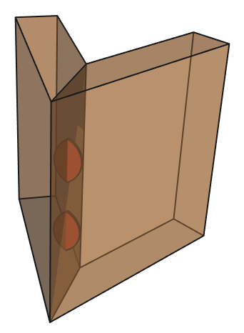

Biscuit Fastener & Usage
-----------------------------

Now that we've made our ``Panel`` and ``Biscuit``, we can create a ``Fastener`` to
apply the ``Biscuit`` to anything, in this case 2 joined ``Panels``.

Then demonstrate it in a fully functioning *assembly*.

Biscuit Fastener
^^^^^^^^^^^^^^^^^^^^^^^

To understand how this fastener works, first read :ref:`cqparts_fasteners.build_cycle`.

**Evaluator**

The evaluation will be made from the center of the biscuit, or more accurately,
where the biscuit will be.

Therefore we'll need to test the depth of available material in 2 directions.

**Selector**

The selector will dtermine the maximum available material in the *panels*, then
create and place an apropriately sized ``Biscuit``.

**Applicator**

With the ``Biscuit`` in place, vacancies need to be cut out of each ``Panel``.

.. doctest::

    from cqparts_fasteners.fasteners.base import Fastener
    from cqparts_fasteners.utils.evaluator import Evaluator, VectorEvaluator
    from cqparts_fasteners.utils.selector import Selector
    from cqparts_fasteners.utils.applicator import Applicator

    from cqparts.constraint import Fixed
    from itertools import chain

    class BiscuitFastener(Fastener):
        # Parameters
        ratio = FloatRange(0, 1, 0.5, doc="ratio penetration of biscuit into parts")
        cut_biscuit_holes = Boolean(True, doc="if True, biscuit holes are cut into pannels")

        class Evaluator(Evaluator):
            # Bi-directional evaluator, employes 2 VectorEvaluator instances that,
            # on their own, evaluate in the -Z direction
            def __init__(self, parts, location, parent=None):
                super(BiscuitFastener.Evaluator, self).__init__(parts=parts, parent=parent)
                self.location = location
                # positive z direction
                self.eval_pos = VectorEvaluator(parts, location.rotated((180, 0, 0)))
                # negative z direction
                self.eval_neg = VectorEvaluator(parts, location)

            def perform_evaluation(self):
                return (self.eval_pos.eval, self.eval_neg.eval)

        class Selector(Selector):
            def get_components(self):
                # Determine maximum biscuit width from the evaluations
                (pos, neg) = self.evaluator.eval
                pos_length = abs(pos[-1].end_point - pos[0].start_point)
                neg_length = abs(neg[-1].end_point - neg[0].start_point)
                max_width = 2 * min(
                    pos_length * self.parent.ratio,  # parent is the BiscuitFastener instance
                    neg_length * self.parent.ratio
                )

                return {
                    'biscuit': Biscuit(
                        width=max_width,
                        thickness=max_width * 0.1,
                    ),
                }

            def get_constraints(self):
                #(pos, neg) = self.evaluator.eval
                return [
                    Fixed(
                        self.components['biscuit'].mate_origin,
                        CoordSystem().rotated((90, 0, 90))  # corectly orientate biscuit
                    ),
                ]

        class Applicator(Applicator):
            def apply_alterations(self):
                if not self.parent.cut_biscuit_holes:
                    return  # fastener configured to place biscuit overlapping panel

                # Get the biscuit cutout shape
                biscuit = self.selector.components['biscuit']
                biscuit_cutter = biscuit.make_cutter()  # cutter in local coords

                # Duplicate parts possible with floating point rounding, because the
                # evaluator is placed on the 2 planar surfaces being joined.
                effected_parts = set([  # duplicates are removed within the set
                    effect.part for effect in chain(*self.evaluator.eval[:])
                ])

                # Move biscuit relative to altered part's local coordinates, then
                # alter the part's local_obj.
                for part in effected_parts:
                    biscuit_coordsys = biscuit.world_coords - part.world_coords
                    part.local_obj = part.local_obj.cut(biscuit_coordsys + biscuit_cutter)

Corner Assembly
^^^^^^^^^^^^^^^^^^^^^^^^^

To demonstrate the ``BiscuitFastener`` we've just created, we'll join 2
``Panels`` then apply an arbitrary number of biscuits to the join (evenly spaced
along the join).

.. doctest::

    from cqparts.constraint import Fixed, Coincident

    class CornerAssembly(cqparts.Assembly):
        biscuit_count = PositiveInt(2, doc="number of biscuits")
        join_angle = FloatRange(0, 89, 45, doc="angle of join (unit: degrees)")
        biscuit_holes = Boolean(True, doc="if True, holes are cut into pannels to house biscuits")

        def make_components(self):
            components = {
                'a': Panel(join_angle=self.join_angle),
                'b': Panel(join_angle=self.join_angle),
            }
            for i in range(self.biscuit_count):
                components['f_%i' % i] = BiscuitFastener(
                    parts=[components['a'], components['b']],
                    cut_biscuit_holes=self.biscuit_holes,
                )
            return components

        def make_constraints(self):
            # position joined panels
            a = self.components['a']
            b = self.components['b']
            yield [
                Fixed(a.mate_origin),
                Coincident(
                    b.mate_join_reverse,
                    a.mate_join
                ),
            ]

            # position biscuits along join
            biscuits = [
                c for c in self.components.values()
                if isinstance(c, BiscuitFastener)
            ]
            yield [
                Coincident(
                    c.mate_origin,
                    a.get_mate_join(
                        ratio=(i + 1) * (1. / (len(biscuits) + 1))
                    )
                )
                for (i, c) in enumerate(biscuits)
            ]

So to illustrate what we've just made::

    corner_assembly = CornerAssembly()
    display(corner_assembly)

.. raw:: html

    <iframe class="model-display"
        src="../../_static/iframes/biscuit/corner_assembly.html"
        height="300px" width="100%"
    ></iframe>

.. figure:: img/applied-45deg.png

    FreeCAD's render may be more clear (literally).

The assembly hierarchy::

    print(corner_assembly.tree_str())

::

    <CornerAssembly: biscuit_count=2, biscuit_holes=True, join_angle=45.0>
     ├○ a
     ├○ b
     ├─ f_0
     │   └○ biscuit
     └─ f_1
         └○ biscuit

Varying Join Angle
^^^^^^^^^^^^^^^^^^^^^^^^^

When the join angle is changed, the depth of material for the biscuit to use
changes.

With an angle of :math:`30°`, more material is available, so the
biscuits are larger::

    display(CornerAssembly(join_angle=30))

.. image:: img/applied-30deg.png

And with an angle of :math:`60°`, less material is available, so the
biscuits are smaller::

    display(CornerAssembly(join_angle=60))

