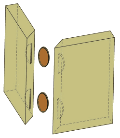

Example: Biscuit Join
========================

A biscuit join in woodworking uses an auxiliary piece of material to increase
adhesion strength of a glued join. Biscuit joins have  no externally visible
components.

    Example of a biscuit join.

This *fastener* example has 2 main challenges that differ from a conventional
screw or bolt fastener:

#. the biscuit is centered *between* the 2 effected parts
#. the biscuit's orientation is important.

::

    biscuit_fastener_1
       └─○ biscuit

.. toctree::
  :maxdepth: 2
  :caption: Contents:

  component-parts
  fastener
