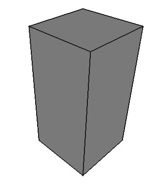
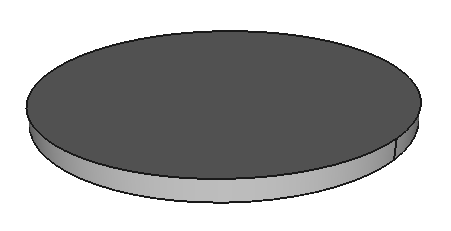
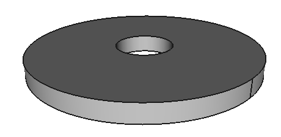

.. _tutorial_part:

.. currentmodule:: cqparts.part

Make your own ``Part``
======================

A :class:`Part` is a blueprint for an *atomic* solid to be placed into an
:class:`Assembly`.

Before continuing here, it's highly recommend you read
:ref:`part_vs_assembly` and :ref:`tutorials_parametricobject`.

Let's start with a simple variably sized rectangle.

.. doctest::

    >>> import cadquery
    >>> import cqparts
    >>> from cqparts.params import *

    >>> class Box(cqparts.Part):
    ...     length = PositiveFloat(10, doc="box length (along x-axis)")
    ...     width = PositiveFloat(10, doc="box width (along y-axis)")
    ...     height = PositiveFloat(10, doc="box height (along z-axis)")
    ...
    ...     def make(self):
    ...         return cadquery.Workplane('XY').box(
    ...             self.length, self.width, self.height,
    ...             centered=(True, True, False),
    ...         )

    >>> box = Box(height=20)
    >>> cqparts.display.display(box) # doctest: +SKIP

    ``display`` will render the :class:`cadquery.Workplane` instance pulled from
    ``box.local_obj``.

.. tip::

    Remember, your :class:`Part` is a Python class, so you can take advantage
    of everything Python has to offer.

Adding ``Mates``
----------------

A :class:`Mate <cqparts.constraints.mate.Mate>` defines a coordinate system
relative to the :class:`Part` origin.

A *mate* is used by an :class:`Assembly` to help place parts. More on this
in the :ref:`tutorial_assembly` chapter.

A *mate* is often best defined by a :class:`Part` because they're placement is
highly dependent on the *part's* parameters.

So to elaborate on the box example above::

    >>> from cqparts.constraints.mate import Mate

    >>> class Box(cqparts.Part):
    ...     # ... (content as above)
    ...     @property
    ...     def mate_top(self):
    ...         return Mate((0, 0, self.height))

    >>> box = Box()
    >>> box.mate_top # doctest: +SKIP

This will return a *mate* placed in the middle of the boxes top face.

But wait... :mod:`cadquery` offers another way to achieve the same result::

    >>> from cqparts.constraints.mate import Mate

    >>> class Box(cqparts.Part):
    ...     # ... (content as above)
    ...     @property
    ...     def mate_top(self):
    ...         plane = self.local_obj.faces(">Z").workplane().plane
    ...         return Mate.from_plane(plane)

    >>> box = Box()
    >>> box.mate_top # doctest: +SKIP

In this case, the first is probably the best, due to its simplicity.

However, being able to query the part's geometry to find mating points is
a powerful feature that can be exploited.

.. tip::

    To reiterate, these are just Python classes, the above ``mate_top``
    method can be called anything.

    You could also create a method that takes a parameter such as
    ``get_mate_top(twist_angle=0)`` to adjust the *mate* in a way that's
    relevant to the *part*.

    Some advice though, don't make your *part* behave too differently to
    other parts you're using, it will make your code confusing.

Modifying
---------

You may want to use an existing part, and modify it without copying the code.

Let's try a few examples of ways you can achieve this effectively.

Inheritance : Cutting a Hole
^^^^^^^^^^^^^^

Let's re-invent the wheel:

.. doctest::

    >>> import cadquery
    >>> import cqparts
    >>> from cqparts.params import *

    >>> class Wheel(cqparts.Part):
    ...     radius = PositiveFloat(100, doc="wheel's radius")
    ...     width = PositiveFloat(10, doc="wheel's width")
    ...     def make(self):
    ...         return cadquery.Workplane('XY') \
    ...             .circle(self.radius).extrude(self.width)

    >>> wheel = Wheel()
    >>> cqparts.display.display(wheel) # doctest: +SKIP

However, we want to put this onto an axel, so we need to cut a hole through
the center.

So let's make our own wheel, using this wheel as a base.

We inherit the above ``Wheel``, then in the ``make`` method we get the original
object, then return a modified version::

    >>> class HolyWheel(Wheel):
    ...     hole_diameter = PositiveFloat(20, "diameter for shaft")
    ...     def make(self):
    ...         obj = super(HolyWheel, self).make()
    ...         return obj.faces(">Z").circle(self.hole_diameter / 2) \
    ...             .cutThruAll()

    >>> my_wheel = HolyWheel(hole_diameter=50, width=15)
    >>> cqparts.display.display(my_wheel) # doctest: +SKIP

    The wheel was also made a bit wider to show the old parameters are still
    in effect.

Use an Instance : Union 2 Parts
^^^^^^^^^^^^^^^^^^^^^^^^^^^^^^^

.. warning::

    TODO

Registering
-----------

.. warning::

    TODO
