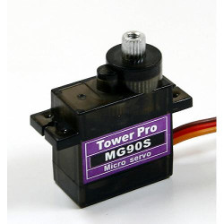

Servo Motor
===========

This example is based on the first servo I grabbed from my shelf

.. note::

    TowerPro MG90S Micro servo
    (`TowerPro site <http://www.towerpro.com.tw/product/mg90s-3/>`_)

Accuracy
--------------

Default `external` measurements will be to specification (so you may use it in
your own creations without issue).

Default `internal` measurements, and design will be estimated based on external
observation; I'm not looking to infringe copyright.

What I design might actually work if you printed it, but that's not the point
of this excercise

.. _examples_servo_hierarchy:

Hierarchy
---------------

The servo's :class:`Assembly` contains the following :class:`Assembly` and
:class:`Part` instances::

    servo
     ├── enclosure
     │   ├─○ shell
     │   ├─○ end_cap
     │   └── fasteners
     │       ├── front_left
     │       │   ├─○ bolt
     │       │   ├─○ washer (?)
     │       │   └─○ nut
     │       ├── front_right
     │       │      ...
     │       ├── back_left
     │       │      ...
     │       └── back_right
     │              ...
     ├── gearbox
     │   ├── bearing
     │   │   ├─○ outer_ring
     │   │   ├── rolling_elements
     │   │   │   ├─○ ball_1
     │   │   │   │  ...
     │   │   │   └─○ ball_n
     │   │   ├─○ retainer
     │   │   └─○ inner_ring
     │   ├─○ main_shaft
     │   ├─○ middle_shaft
     │   └─○ drive_shaft
     ├── motor
     │   ├── base_bearing ...
     │   ├── drive_bearing ...
     │   ├── rotor
     │   │   └○ shaft
     │   └─○ stator
     └─ driver
         ├── board
         │   ├─○ pcb
         │   ├── ... (components)
         │   └─○ potentiometer
         └─○ connector

Where:

* ``─`` denotes an :class:`Assembly`, and
* ``○`` denotes a :class:`Part`

The idea being that following branches should always end in a :class:`Part`
(so the ``○`` is a leaf)

Display
------------

::

    from cqparts import display
    # TODO: import Servo
    servo = Servo()  # use default values

    display(
        servo,
        highlight=[
            servo.find('gearbox.bearing'),   # assembly (branch)
            servo.find('motor.rotor.shaft'), # part (leaf)
        ],
    )
