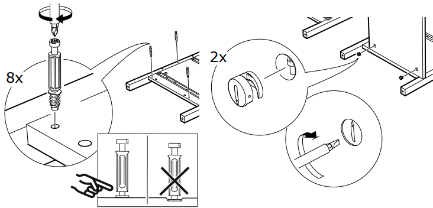

.. _tutorials_fastener-easy-install:

Fastener : Easy Install
=======================

This example illustrates how to make the classic *build-it-yourself*
furniature fastener for wood panels connected at right angels.

    Example of the instructions you may find in a manual.

Component Parts
---------------

The composition of this fastener is relatively simple; we smiply have 2 parts
grouped into a single mechanical fastener.

::

    easy_fastener_1
       ├─○ wood_screw
       └─○ anchor

Wood Screw
^^^^^^^^^^

The wood screw will be a simplified version of the one shown in the diagram:

* **head** : 'cheese' fastener head (:class:`CheeseFastenerHead <cqparts.types.fastener_heads.cylindrical.CheeseFastenerHead>`)
* **screw drive** : 'phillips' screw drive (:class:`PhillipsScrewDrive <cqparts.types.screw_drives.cruciform.PhillipsScrewDrive>`)
* **shaft** : mostly a thick cylindrical shaft, same diameter as the *head*, which
  thins to ~1/2 the size closer to the *head*.

::

    from cqparts import Part
    from cqparts.params import PositiveFloat
    #from cqparts.fasteners.params import HeadType, DriveType, ThreadType

    class WoodScrew(Part):
        diameter = PositiveFloat(default=3, doc="bore hole diameter")
        thread_length = PositiveFloat(default=5, doc="distance the screw bores into part")
        # TODO: more parameters

        def make(self):
            TODO: code for wood screw make()

So to illustrate what we've just made::

    from cqparts_mylib.easyinstall import WoodScrew  # pretending it's there

    screw = WoodScrew(thread_length=4)
    # with a thread length just to show we
    # can change any of the parameters

    from cqparts.display import display
    display(screw)

.. figure:: img/easy-install-woodscrew.png

    TODO: placeholder graphic, put a screenshot here.

Anchor
^^^^^^

Similarly, the anchor will be simplified

* **main body** : the anchor will be cut from a large cylindrical block.
* **screw drive** : 'cross' screw drive (:class:`CrossScrewDrive <cqparts.types.screw_drives.slotted.CrossScrewDrive>`)
* **initial slot** : a rectangle the width of the woodscrew's diameter will be cut
  from the *main body*
* **rotary slot** : 270 degrees of a coin shape will be subtracted from the center
  of the *main body* (to accomodate the *wood screw* shaft just below it's *head*)
* **circular wedge** : an eccentric cylinder is cut from the *main body*

::

    from cqparts import Part
    from cqparts.params import PositiveFloat, Boolean

    class Anchor(Part):
        diameter = PositiveFloat(default=10, doc="bore diameter for anchor")
        reversed = Boolean(default=False, doc="if True, screw drive is put on the reverse side")
        # TODO more parameters

        def make(self):
            # TODO: code to build anchor

So to illustrate what we've just made::

    from cqparts_mylib.easyinstall import Anchor  # pretending it's there

    anchor = Anchor(diameter=11)
    # with a changed diameter just to show we
    # can change any of the parameters

    from cqparts.display import display
    display(anchor)

.. figure:: img/easy-install-anchor.png

    TODO: placeholder graphic, put a screenshot here.

Evaluation / Selection / Application
------------------------------------

.. currentmodule:: cqparts.fasteners.utils

Now we need to assess the logic behind the application of this
fastening mechanism.

.. tip::

    *Evaluation*, *selection*, and *application* are fundamental concepts for
    using fasteners as more than just floating objects, read
    :ref:`parts_fasteners_using` to learn more.

To do this manually, we'd have to:

* **evaluate** (or measure) the diameter and depth of the woodscrew's pilot hole, as well
  as the location and size of the anchor's cylindrical bore on the other workpiece.
* **select** an apropriately sized wood-screw and anchor (based on the
  evaluation we've made).
* **apply** the pilot hole, and anchor's bore. Then screw in the wood-screw,
  insert the anchor, and then put it all together.

Evaluator
^^^^^^^^^

We don't need anything special for the fastener evaluation; we can use the
standard :class:`VectorEvaluator`.

.. warning::

    TODO: insert image for an evaluation

Selection
^^^^^^^^^

To illustrate the selection mechanic, we'll register 2 types of *wood screw*
for this fastener:

#. 20mm shaft, 10mm thread
#. 40mm shaft, 15mm thread

and 2 types of *anchor*:

#. 15mm diameter
#. 20mm diameter

The selector will choose a *wood screw* with the longest shaft, with a thread
that taps into <= 80% of the adjoining piece.

::

    from cqparts.fasteners.utils.selector import Selector

    class EasyInstallSelector(Selector):
        #TODO: code for selector
        # note: selector must return a wood-screw and anchor
        #       does it return a Fastener instance?
        pass

        def get_selection(self):
            # TODO: returns single Fastener instance
            # if there are multiple viable choices, it's up to the selector
            # to narrow it down to a single selection.
            pass

Application
^^^^^^^^^^^

The evaluation should result in 2
:class:`VectorEffect <evaluator.VectorEffect>` instances, one for
each part.

::

    from cqparts.fasteners.utils.applicator import Applicator

    class EasyInstallApplicator(Applicator):
        # TODO: code for applicator
        pass

Fastener Assembly
-----------------

So now we have the 2 components, we can combine these into a
:class:`Fastener <cqparts.fasteners.base.Fastener>`.

::

    from cqparts.fasteners import Fastener

    class EasyInstallFastener(Fastener):
        EVALUATOR_CLASS = VectorEvaluator
        SELECTOR_CLASS = EasyInstallSelector
        APPLICATOR_CLASS = EasyInstallApplicator

        def make(self):
            screw = WoodScrew()  # TODO: parameters + mate

            anchor = Anchor()  # TODO: parameters + mate

            return {
                'wood_screw': screw,
                'anchor': anchor,
            }

Using the Fastener
------------------

Now that we've made it, this is how it can be imported and used.

First let's make some parts to join together::

    # fixme: pretending it's there
    import cadquery
    from cqparts import Part

    class Panel1(Part):
        def make(self):
            return cadquery.Workplane('XY', origin=(0, -50, -10)) \
                .box(100, 100, 10, centered=(False, False, False))

    class Panel2(Part):
        def make(self):
            return cadquery.Workplane('XY', origin=(0, -50, 0)) \
                .box(10, 100, 100, centered=(False, False, False))

Now we import and use the ``EasyinstallFastener`` we've created::

    from cqparts_mylib.easyinstall import EasyInstallFastener

    # TODO: 2 instances of the same panel, different orientation
    panel1 = Panel1()
    panel2 = Panel2()

    evaluation = EasyInstallFastener.evaluate(
        parts
